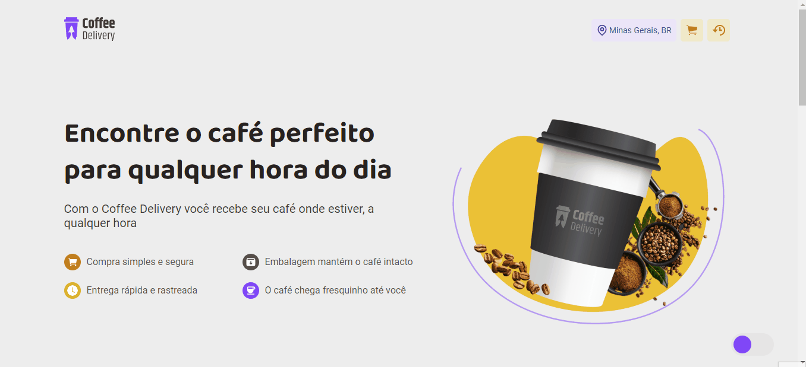
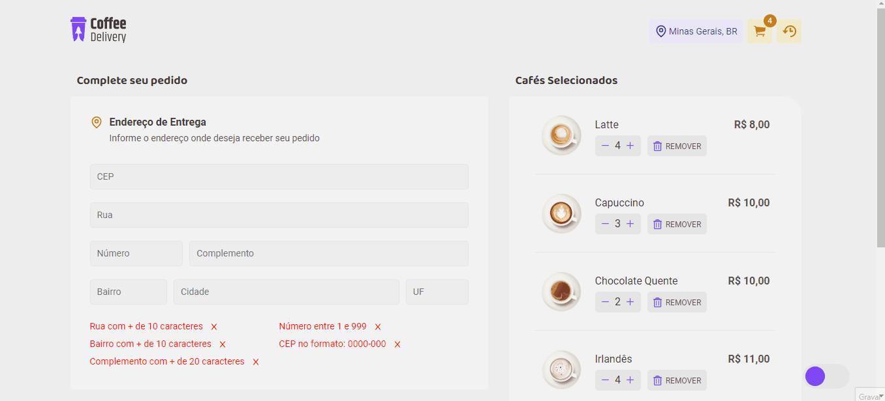
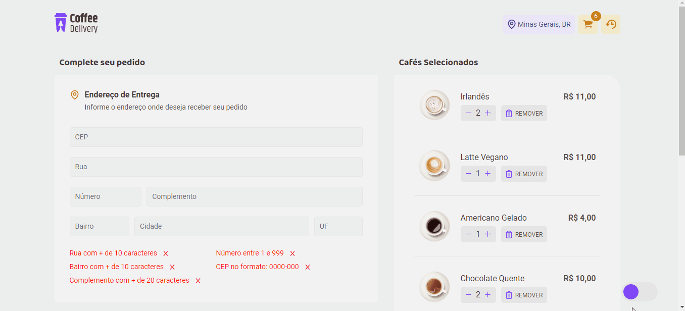

<h1 align="center">🥤 Coffee Delivery ☕</h1>

 

<h3 align="center">Um site de delivery de cafés desenvolvido com React + Typescript para a trilha de React do Ignite, Rocketseat.</h3>

---

<h2>Demonstração 🎥</h2>

_<h3>Um pequeno tour pelo Projeto 💻</h3>_

_<h3>Adicionando e removendo cafés do carrinho 🛒</h3>_

_<h3>Completando Pedidos 📦</h3>_

_<h3>Vendo o Histórico 📄</h3>_

 

---

<h2>Fui além do desafio! 🚀</h2>

 

- ✔️ Fiz o website ser `responsivo`
- ✔️ Adicionei um `tema escuro`
- ✔️ Coloquei `auto complete da cidade e do UF` baseado no CEP
- ✔️ Desenvolvi uma página para ver o `histórico de pedidos`
- ✔️ Adicionei `mensagens` para notificar o usuário
- ✔️ Desenvolvi uma `validação do formulário` em tempo real

 

---

<h2>Mas, o que eu aprendi? 🤔</h2>

 

- Aprendi a utilizar `reducers` para manusear estados mais complexos
- Aprendi a utilizar o `React Hook Form e Zod` para os formulários
- Aprendi a usar o `Date-Fns` para manipular datas
- Aprendi a criar `variáveis auxiliares` para deixar o `código mais limpo e legível`

 

---

<h2>Tecnologias Utilizadas 🛠</h2>

#### FrontEnd: `ReactJS!`

- Axios
- React Icons
- React Toastify
- React Hook Form
- Zod Resolver
- Typescript
- Context API
- Uuidv4
- Date-fns
- React Router Dom

 
  
  
  
  
 

 

---

